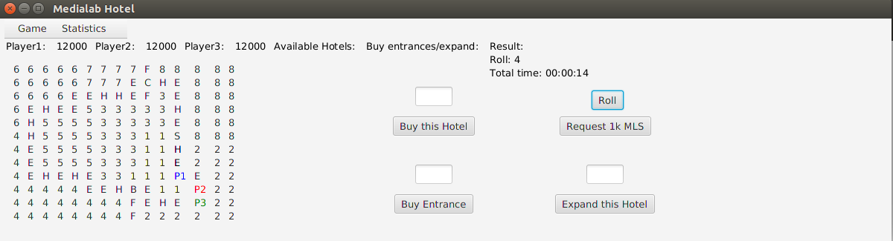

# Implementation of board game "Hotel" using Java
Two boards included in folders *default* and *simple*.  
Graphic GUI including all functionalities of the game written using *JavaFX*.   
- Rolling dice  
- Automated players' movement  
- Buying Hotels or Entrances  
- Expanding Hotels  
- Requesting money  
- Statistics about the game  
- Time the game has been played  
- Stopping and exiting game as well as information about players, hotels and cards  

Image from the board while the game is being played.  
   
  

# Instructions
After cloning run  
```
java eHotel_Game
```

Because code is provided with *.class* files.  
In case of recompile folder *org* is needed.
